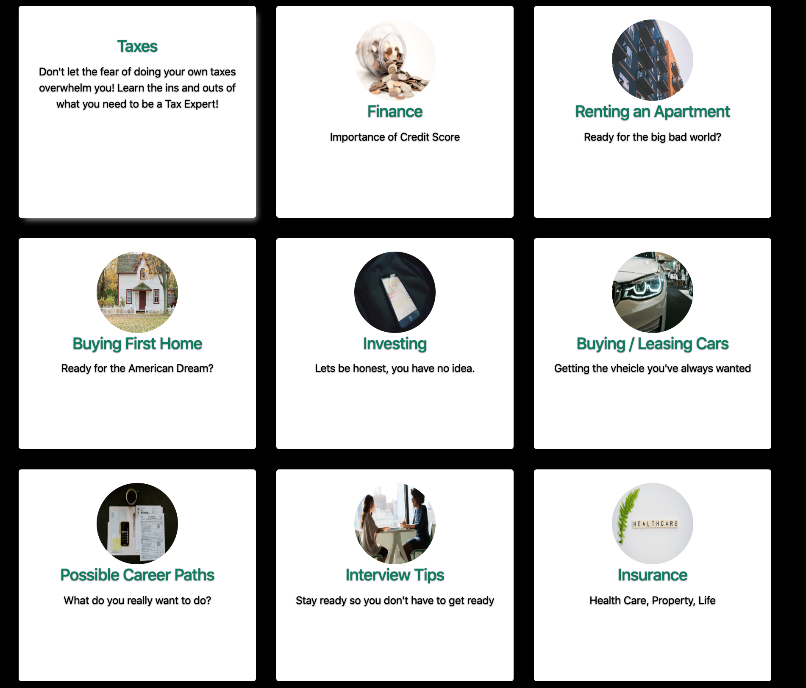
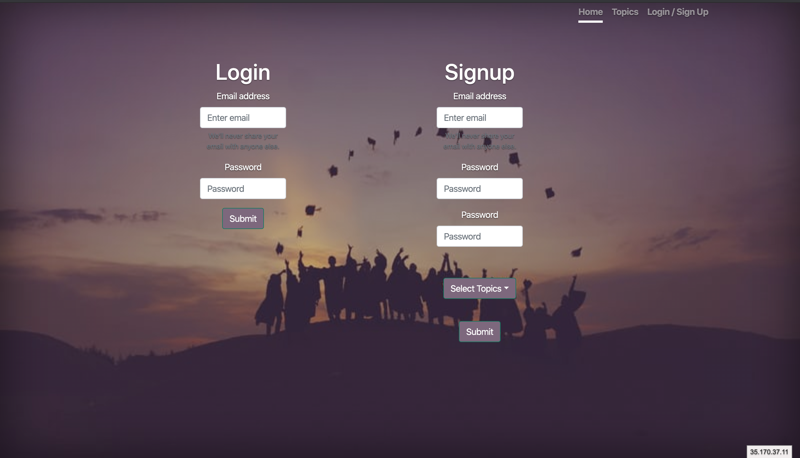

# Transitions

Are you a individual striving for better but not sure where to get the learning tools necessary? look no further!

## Motivation

We created transitions with the thought in mind of giving people the tools necessary to help them transition into adulthood with the knowledge and understanding of topics that sometimes aren't taught well enough in school.
 
## Screenshots

## Tech/framework used

<b>Built with</b>
- [HTML/CSS](https://electron.atom.io)
- [BOOTSTRAP](https://getbootstrap.com/)
- [NODE](https://nodejs.org/en/)
- [EXPRESS](https://expressjs.com/)
- [PASSPORT](http://www.passportjs.org/)
- [MongoDB](https://www.mongodb.com/)
- [HEROKU](https://www.heroku.com/)

## Features

Transitions gives the user the ability to create an account and also choose their favorite topic that they would like to learn about. The user will be able to select from 9 different topics and each topic presents videos and articles that will help you understanding of how each of the different topics work! 

## API Reference

- [YOUTUBE API](https://developers.google.com/youtube)
- [NEWS API](https://newsapi.org/)

Transitions is based on the API calls of YouTube and NEWS heavily to get the information necessary to help the user. The YouTube API pulls the videos that give the user a visual on how to better understand the topic and the NEWS API helps gives the users articles that that can review long after they have left the site!   

## Credits

Make sure you give the Transitions team a round of applause! 

Richard – Set up the database, handle the routes and spearheaded the authentication

Jacob & William – Took care of the frontend design and functionality and worked on front end JS to connect the front and back together.

## Challenges

Getting on the same page design and responsbilities

Learning the Passport authentication and getting it to work

Hiding and showing of element on clicks

## Successes

Working APP in React and on Heroku
